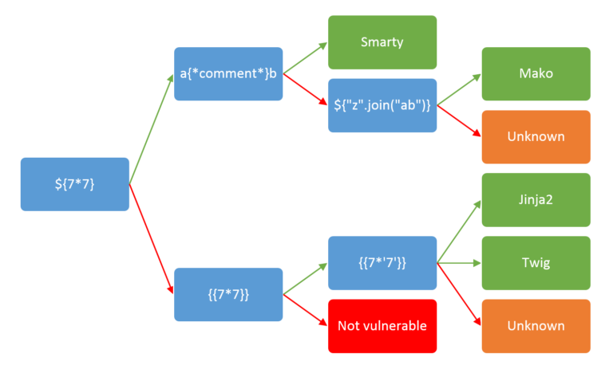

# Server-Side Template Injection

Server-Side Template Injection (SSTI) is a vulnerability that occurs when an attacker is able to inject malicious code into a server-side template. This type of attack targets web applications that utilize server-side templating engines, such as PHP, Ruby, or Python frameworks. By exploiting SSTI, an attacker can manipulate the server-side templates to execute arbitrary code on the server, potentially leading to unauthorized access, data leakage, or even remote code execution.

<figure><figcaption><p>Source: <a href="https://github.com/swisskyrepo/PayloadsAllTheThings/tree/master/Server%20Side%20Template%20Injection">https://github.com/swisskyrepo/PayloadsAllTheThings/tree/master/Server%20Side%20Template%20Injection</a></p></figcaption></figure>

### Payloads

```bash
${{<%[%'"}}%\.
{{7*7}}
${7*7}
<%= 7*7 %>
${{7*7}}
#{7*7}
*{7*7}
```

### References

{% embed url="https://github.com/swisskyrepo/PayloadsAllTheThings/tree/master/Server%20Side%20Template%20Injection" %}
